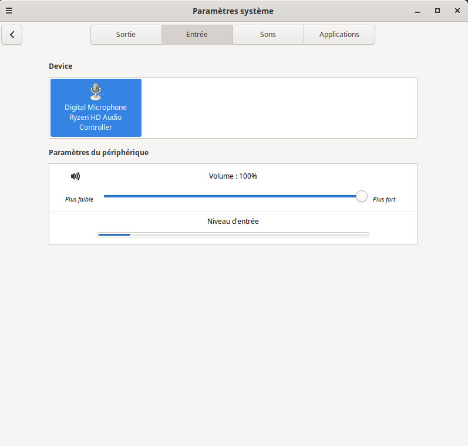

# Fix Micro interne (DMIC) — MSI Bravo 17 C7VE (MS-17LN) — Kali Linux

> **TL;DR** — Le micro interne du MSI Bravo 17 C7VE ne fonctionne pas sous Linux/Kali
> car le modèle est absent de la table de quirks DMI du driver ACP6x.
> Ce dépôt fournit le **patch noyau**, des **scripts automatisés** pour compiler,
> installer et rollback les modules corrigés.



---

## Table des matières

- [Matériel concerné](#matériel-concerné)
- [Symptômes](#symptômes)
- [Cause](#cause)
- [Contenu du dépôt](#contenu-du-dépôt)
- [Pré-requis](#pré-requis)
- [Procédure rapide (scripts)](#procédure-rapide-scripts)
- [Procédure manuelle détaillée](#procédure-manuelle-détaillée)
  - [Étape 1 — Vérifier les identifiants DMI](#étape-1--vérifier-les-identifiants-dmi)
  - [Étape 2 — Télécharger les sources du noyau](#étape-2--télécharger-les-sources-du-noyau)
  - [Étape 3 — Ajouter l'entrée DMI](#étape-3--ajouter-lentrée-dmi-bravo-17-c7ve)
  - [Étape 4 — Compiler les modules](#étape-4--recompiler-uniquement-les-modules-acp6x)
  - [Étape 5 — Installer en override](#étape-5--installer-les-modules-patchés-override)
- [Vérification après reboot](#vérification-après-reboot)
- [Résultat attendu](#résultat-attendu)
- [Après mise à jour du noyau](#après-mise-à-jour-du-noyau)
- [Rollback](#rollback)
- [Notes & FAQ](#notes--faq)
- [Licence](#licence)

---

## Matériel concerné

| Champ            | Valeur                                      |
|------------------|---------------------------------------------|
| Laptop           | MSI **Bravo 17 C7VE**                       |
| `board_vendor`   | `Micro-Star International Co., Ltd.`        |
| `sys_vendor`     | `Micro-Star International Co., Ltd.`        |
| `product_name`   | `Bravo 17 C7VE`                             |
| `board_name`     | `MS-17LN`                                   |
| Codec audio      | Realtek ALC256                               |
| Micro interne    | DMIC via **AMD ACP6x** (Yellow Carp)         |
| Distribution     | Kali rolling (PipeWire + WirePlumber)        |

---

## Symptômes

- Dans **pavucontrol** → Input Devices : seulement **"Microphone (non branché)"** (jack), aucune option micro interne.
- `pactl list sources` ne montre qu'un port `analog-input-mic` marqué **not available**.
- Les barres VU-mètre bougent seulement quand une vidéo joue → tu enregistres le **monitor** (son de sortie), pas le micro.

### Sortie typique avant fix

```
Ports: analog-input-mic ... not available
```

- Aucun port **internal mic / dmic**
- Le **Default Source** peut rester sur le monitor :

```
Default Source: alsa_output.pci-0000_06_00.6.analog-stereo.monitor
```

> **Note :** même si WirePlumber a mémorisé la bonne source micro, cela ne règle pas
> l'absence de port DMIC. Le vrai problème est au niveau **noyau/driver** (voir section Cause).

### Diagnostic rapide

```bash
# Profil PipeWire en "sortie seule" ?
pactl list cards | grep "Active Profile"

# Port micro disponible ?
pactl list sources | sed -n '/Name: alsa_input.pci-0000_06_00.6.analog-stereo/,/Active Port:/p'
```

---

## Cause

Le micro interne est un **DMIC** géré par le *machine driver* **ACP6x** (plateforme AMD **"Yellow Carp"**).

Ce driver active le DMIC **uniquement** pour les modèles répertoriés dans une **table de quirks DMI** :

- **Fichier noyau** : `sound/soc/amd/yc/acp6x-mach.c`
- **Table** : `yc_acp_quirk_table[]`

Le modèle **MSI Bravo 17 C7VE** n'était **pas listé** dans cette table (alors que d'autres MSI Bravo le sont, comme le Bravo 17 D7VF). En conséquence, le driver ne déclenche jamais le message `"Enabling ACP DMIC support via DMI"` et le DMIC reste invisible pour ALSA / PipeWire.

---

## Contenu du dépôt

```
.
├── LICENSE.md                                            # GPL-2.0-or-later
├── README.md                                             # Ce fichier
├── patches/
│   └── 0001-msi-bravo17-c7ve-add-dmi-quirk-acp6x.patch  # Patch noyau (format git)
└── scripts/
    ├── rebuild_acp6xfix.sh      # Tout-en-un : source → patch → compile → install
    ├── install_override.sh      # Installe des .ko déjà compilés en override
    └── rollback.sh              # Supprime l'override et restaure les modules stock
```

---

## Pré-requis

```bash
sudo apt update
sudo apt install -y dkms build-essential git linux-headers-$(uname -r)
```

Assure-toi que **`deb-src`** est activé dans `/etc/apt/sources.list` :

```bash
sudo tee /etc/apt/sources.list >/dev/null <<'EOF'
deb     http://http.kali.org/kali kali-rolling main contrib non-free non-free-firmware
deb-src http://http.kali.org/kali kali-rolling main contrib non-free non-free-firmware
EOF
sudo apt update
```

---

## Procédure rapide (scripts)

### Build + install tout-en-un

```bash
cd /chemin/vers/acp6x-dmic-fix-msi-bravo17c7ve
sudo ./scripts/rebuild_acp6xfix.sh
sudo reboot
```

### Install uniquement (si déjà compilé)

```bash
sudo ./scripts/install_override.sh /chemin/vers/sound/soc/amd/yc
sudo reboot
```

### Rollback

```bash
sudo ./scripts/rollback.sh
```

---

## Procédure manuelle détaillée

### Étape 1 — Vérifier les identifiants DMI

```bash
sudo cat /sys/devices/virtual/dmi/id/board_vendor
sudo cat /sys/devices/virtual/dmi/id/sys_vendor
sudo cat /sys/devices/virtual/dmi/id/product_name
sudo cat /sys/devices/virtual/dmi/id/board_name
```

Attendu :

```
Micro-Star International Co., Ltd.
Micro-Star International Co., Ltd.
Bravo 17 C7VE
MS-17LN
```

### Étape 2 — Télécharger les sources du noyau

```bash
mkdir -p ~/src && cd ~/src
apt source linux
cd linux-*
```

### Étape 3 — Ajouter l'entrée DMI "Bravo 17 C7VE"

**Fichier** : `sound/soc/amd/yc/acp6x-mach.c`

Dans `yc_acp_quirk_table[]`, repère un bloc MSI existant (ex. `"Bravo 17 D7VF"`) et ajoute **juste après** (sans rien supprimer) :

```c
	{
		.driver_data = &acp6x_card,
		.matches = {
			DMI_MATCH(DMI_BOARD_VENDOR, "Micro-Star International Co., Ltd."),
			DMI_MATCH(DMI_PRODUCT_NAME, "Bravo 17 C7VE"),
		}
	},
```

> **Important** : ne supprime **aucune** entrée existante (les autres quirks servent à d'autres laptops).

Ou applique directement le patch :

```bash
PATCH_FILE=/chemin/vers/patches/0001-msi-bravo17-c7ve-add-dmi-quirk-acp6x.patch

# Check idempotence (ne modifie rien)
patch --forward --dry-run -p1 < "$PATCH_FILE"

# Applique le patch seulement s'il n'est pas déjà présent
patch --forward -p1 < "$PATCH_FILE"
```

Si `--dry-run` retourne un échec avec :

```text
Reversed (or previously applied) patch detected!  Skipping patch.
```

alors le patch est déjà appliqué (comportement normal).

### Étape 4 — Recompiler uniquement les modules ACP6x

```bash
KDIR="/lib/modules/$(uname -r)/build"
make -C "$KDIR" M="$PWD/sound/soc/amd/yc" modules -j"$(nproc)"
```

Vérifier :

```bash
find sound/soc/amd/yc -maxdepth 1 -name "*.ko" -ls
```

Modules attendus :

| Module                     | Rôle                        |
|----------------------------|-----------------------------|
| `snd-pci-acp6x.ko`        | Driver PCI ACP6x            |
| `snd-acp6x-pdm-dma.ko`    | DMA PDM (transport DMIC)    |
| `snd-soc-acp6x-mach.ko`   | Machine driver (quirks DMI) |

### Étape 5 — Installer les modules patchés (override)

```bash
sudo mkdir -p /lib/modules/$(uname -r)/updates/acp6xfix

sudo install -m 0644 sound/soc/amd/yc/snd-pci-acp6x.ko        /lib/modules/$(uname -r)/updates/acp6xfix/
sudo install -m 0644 sound/soc/amd/yc/snd-acp6x-pdm-dma.ko    /lib/modules/$(uname -r)/updates/acp6xfix/
sudo install -m 0644 sound/soc/amd/yc/snd-soc-acp6x-mach.ko   /lib/modules/$(uname -r)/updates/acp6xfix/

sudo depmod -a
sudo update-initramfs -u -k "$(uname -r)"
sudo reboot
```

> Les modules dans `updates/` sont **prioritaires** sur ceux du noyau stock grâce à la convention `depmod`.

---

## Vérification après reboot

### A) Message dmesg

```bash
dmesg | grep -i "Enabling ACP DMIC support"
```

Attendu : une ligne contenant `"via DMI"`.

### B) Cartes ALSA

```bash
cat /proc/asound/cards
arecord -l
```

Tu devrais voir une entrée **DMIC capture** liée à `acp6x`.

### C) Sources PipeWire

```bash
pactl list short sources
```

Tu dois voir les sources **HiFi Mic** :

```
alsa_input.pci-0000_06_00.6.HiFi__Mic1__source
alsa_input.pci-0000_06_00.6.HiFi__Mic2__source
```

### D) Test dans pavucontrol

> **Input Devices** → une entrée micro utilisable, les barres VU-mètre bougent quand tu parles.

---

## Résultat attendu

| Avant fix                                    | Après fix                                             |
|----------------------------------------------|-------------------------------------------------------|
| Seulement `analog-input-mic (not available)` | `HiFi__Mic1__source` + `HiFi__Mic2__source`          |
| Default Source = `...monitor`                | Default Source = micro interne                         |
| pavucontrol : "Microphone (non branché)"     | pavucontrol : micro interne actif, barres qui bougent |

---

## Après mise à jour du noyau

Le fix est lié à la version du noyau (`uname -r`). Après un upgrade kernel :

1. Les modules override ne couvrent que l'ancien kernel
2. Il faut **recompiler** contre les nouveaux headers et **réinstaller**

```bash
# Vérifier si le fix est toujours actif
uname -r
pactl list short sources
```

Si les sources `HiFi__Mic*` disparaissent :

```bash
sudo ./scripts/rebuild_acp6xfix.sh
sudo reboot
```

> **Astuce** : tant que le patch n'est pas intégré upstream dans le noyau Linux,
> il faudra refaire cette opération à chaque nouveau kernel.

---

## Rollback

### Via le script

```bash
sudo ./scripts/rollback.sh
```

### Manuellement

```bash
sudo rm -rf /lib/modules/$(uname -r)/updates/acp6xfix
sudo depmod -a
sudo update-initramfs -u -k "$(uname -r)"
sudo reboot
```

Après reboot, le système revient aux modules noyau d'origine (sans le quirk).

---

## Notes & FAQ

### Le "monitor" c'est quoi ?

Le **monitor** est une source virtuelle PipeWire/PulseAudio qui capture le **son de sortie** (haut-parleurs). Ce n'est **pas** un périphérique d'entrée micro. Il est normal qu'il existe toujours après le fix.

### Secure Boot

Si Secure Boot est activé, les modules recompilés localement peuvent être **refusés** au chargement :

```bash
mokutil --sb-state
```

Si le résultat est `SecureBoot enabled`, tu as deux options :
- **Désactiver** Secure Boot dans le BIOS/UEFI
- **Signer** les modules avec une clé MOK (Machine Owner Key)

### Ce fix est-il spécifique à mon modèle ?

Oui. Le quirk DMI ajouté matche uniquement :
- `DMI_BOARD_VENDOR` = `Micro-Star International Co., Ltd.`
- `DMI_PRODUCT_NAME` = `Bravo 17 C7VE`

Il n'affecte aucun autre modèle.

### Pourquoi 3 modules et pas juste le machine driver ?

Les 3 modules (`snd-pci-acp6x`, `snd-acp6x-pdm-dma`, `snd-soc-acp6x-mach`) sont compilés ensemble dans le même dossier `sound/soc/amd/yc/`. On les installe tous les trois par cohérence de version, même si seul `snd-soc-acp6x-mach.ko` contient la table de quirks.

### Peut-on faire le fix sans reboot ?

En théorie, on peut tenter un `rmmod` / `modprobe` à chaud, mais c'est fragile car les modules audio sont souvent en cours d'utilisation. Le **reboot est recommandé**.

---

## Licence

Ce dépôt est distribué sous **GPL-2.0-or-later**, en conformité avec la licence du noyau Linux.

Voir [LICENSE.md](LICENSE.md) pour le texte complet.
