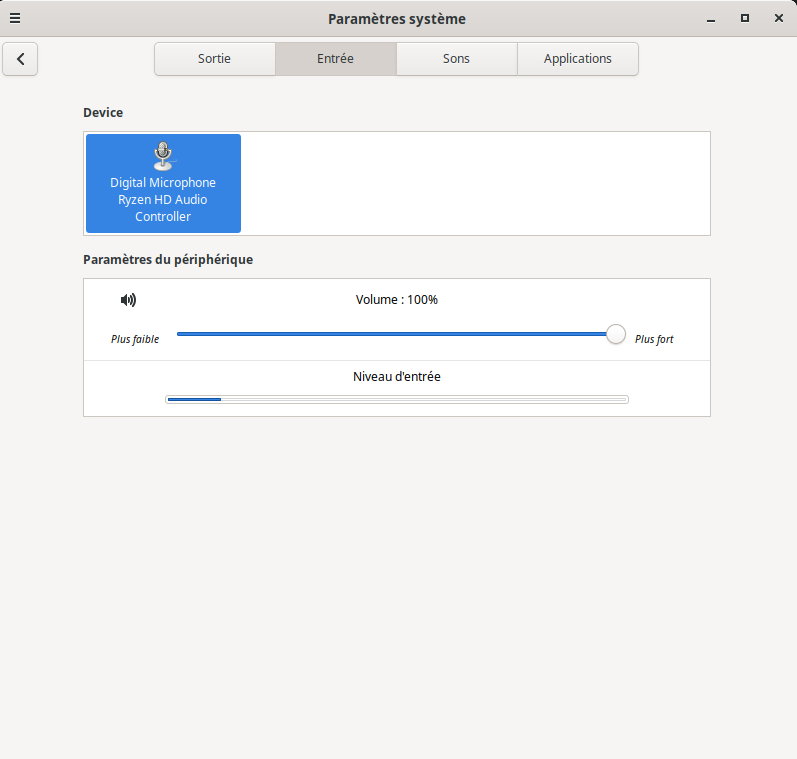

# Internal Microphone (DMIC) Fix — MSI Bravo 17 C7VE (MS-17LN) — Kali Linux (ACP6x)

> TL;DR — On some kernels/distributions, the MSI Bravo 17 C7VE internal microphone (DMIC) is not exposed because this model is missing from the ACP6x machine driver DMI quirk table.
> This repository provides a kernel patch + scripts to build/install/rollback the fixed modules.



---

## Contents

- [Affected hardware](#affected-hardware)
- [Symptoms](#symptoms)
- [Root cause](#root-cause)
- [Repository contents](#repository-contents)
- [Requirements](#requirements)
- [Quick fix (scripts)](#quick-fix-scripts)
- [Manual procedure](#manual-procedure)
  - [Step 1 — Check DMI identifiers](#step-1--check-dmi-identifiers)
  - [Step 2 — Download kernel sources](#step-2--download-kernel-sources)
  - [Step 3 — Add the DMI quirk](#step-3--add-the-dmi-quirk-bravo-17-c7ve)
  - [Step 4 — Build ACP6x modules](#step-4--build-acp6x-modules-only)
  - [Step 5 — Install override modules](#step-5--install-override-modules)
- [Verification after reboot](#verification-after-reboot)
- [Expected result](#expected-result)
- [After a kernel update](#after-a-kernel-update)
- [Rollback](#rollback)
- [Notes & FAQ](#notes--faq)
- [License](#license)

---

## Affected hardware

| Field | Value |
|---|---|
| Laptop | MSI **Bravo 17 C7VE** |
| `board_vendor` | `Micro-Star International Co., Ltd.` |
| `sys_vendor` | `Micro-Star International Co., Ltd.` |
| `product_name` | `Bravo 17 C7VE` |
| `board_name` | `MS-17LN` |
| Audio codec | Realtek **ALC256** |
| Internal mic | **DMIC** via **AMD ACP6x** (Yellow Carp) |
| Distro stack | Kali rolling (PipeWire + WirePlumber) |

---

## Symptoms

- In `pavucontrol` → Input Devices: only a “Microphone (unplugged)” (jack) device, no internal mic.
- `pactl list sources` / `pactl list short sources` does not show a “Digital Microphone / DMIC” source.
- Input meters move only when a video is playing: you are often recording the `...monitor` source (speaker output), not your voice.

Typical “before” state (example):

```text
Ports:
  analog-input-mic: ... (not available)
Active Port: analog-input-mic
```

Note:

- `...monitor` in PipeWire/PulseAudio = capture of the output (speakers). It is not a microphone input.

---

## Root cause

The internal microphone is a DMIC handled by the ACP6x machine driver (AMD “Yellow Carp” platform).
DMIC enablement depends on a DMI quirk table:

- Kernel file: `sound/soc/amd/yc/acp6x-mach.c`
- Table: `yc_acp_quirk_table[]`

On this model, `product_name="Bravo 17 C7VE"` was missing, so the driver did not enable DMIC capture via DMI and the internal mic remained invisible to ALSA/PipeWire.

---

## Repository contents

```text
.
├── LICENSE
├── README.md
├── img/
│   └── fig1.png
├── patches/
│   └── 0001-msi-bravo17-c7ve-add-dmi-quirk-acp6x.patch
└── scripts/
    ├── rebuild_acp6xfix.sh
    ├── install_override.sh
    └── rollback.sh
```

Patch format note:

- If you want to apply with `patch(1)`, the patch should be a unified diff (from `git diff`), not a full email patch (`git format-patch` with `From ...` headers).
- If your patch contains email headers, use `git apply` (inside a git tree) or publish a unified diff patch.

---

## Requirements

```bash
sudo apt update
sudo apt install -y build-essential git dkms linux-headers-$(uname -r) dpkg-dev
```

Make sure `deb-src` is enabled in `/etc/apt/sources.list` (needed for `apt source linux`):

```bash
sudo tee /etc/apt/sources.list >/dev/null <<'EOF'
deb     http://http.kali.org/kali kali-rolling main contrib non-free non-free-firmware
deb-src http://http.kali.org/kali kali-rolling main contrib non-free non-free-firmware
EOF
sudo apt update
```

---

## Quick fix (scripts)

### All-in-one: download → patch → build → install override

From the repo root:

```bash
sudo ./scripts/rebuild_acp6xfix.sh
sudo reboot
```

### Build only (no install)

```bash
sudo ./scripts/rebuild_acp6xfix.sh --no-install
```

### Install override only (if `.ko` files already exist)

```bash
sudo ./scripts/install_override.sh
sudo reboot
```

### Rollback

```bash
sudo ./scripts/rollback.sh
sudo reboot
```

---

## Manual procedure

### Step 1 — Check DMI identifiers

```bash
sudo cat /sys/devices/virtual/dmi/id/board_vendor
sudo cat /sys/devices/virtual/dmi/id/sys_vendor
sudo cat /sys/devices/virtual/dmi/id/product_name
sudo cat /sys/devices/virtual/dmi/id/board_name
```

Expected:

```text
Micro-Star International Co., Ltd.
Micro-Star International Co., Ltd.
Bravo 17 C7VE
MS-17LN
```

### Step 2 — Download kernel sources

```bash
mkdir -p ~/src && cd ~/src
apt source linux
cd linux-*
```

### Step 3 — Add the DMI quirk ("Bravo 17 C7VE")

File: `sound/soc/amd/yc/acp6x-mach.c`

Inside `yc_acp_quirk_table[]`, add (do not remove existing entries):

```c
{
    .driver_data = &acp6x_card,
    .matches = {
        DMI_MATCH(DMI_BOARD_VENDOR, "Micro-Star International Co., Ltd."),
        DMI_MATCH(DMI_PRODUCT_NAME, "Bravo 17 C7VE"),
    }
},
```

Or apply the patch (if it is a unified diff):

```bash
PATCH_FILE=/path/to/patches/0001-msi-bravo17-c7ve-add-dmi-quirk-acp6x.patch

patch --forward --dry-run -p1 < "$PATCH_FILE"
patch --forward -p1 < "$PATCH_FILE"
```

If dry-run reports `Reversed (or previously applied) patch detected`, the patch is already applied.

### Step 4 — Build ACP6x modules only

```bash
KDIR="/lib/modules/$(uname -r)/build"
make -C "$KDIR" M="$PWD/sound/soc/amd/yc" modules -j"$(nproc)"
```

Verify:

```bash
find sound/soc/amd/yc -maxdepth 1 -name "*.ko" -ls
```

Typical modules:

- `snd-pci-acp6x.ko`
- `snd-acp6x-pdm-dma.ko`
- `snd-soc-acp6x-mach.ko`

### Step 5 — Install override modules

```bash
sudo mkdir -p /lib/modules/$(uname -r)/updates/acp6xfix

sudo install -m 0644 sound/soc/amd/yc/snd-pci-acp6x.ko        /lib/modules/$(uname -r)/updates/acp6xfix/
sudo install -m 0644 sound/soc/amd/yc/snd-acp6x-pdm-dma.ko    /lib/modules/$(uname -r)/updates/acp6xfix/
sudo install -m 0644 sound/soc/amd/yc/snd-soc-acp6x-mach.ko   /lib/modules/$(uname -r)/updates/acp6xfix/

sudo depmod -a
sudo update-initramfs -u -k "$(uname -r)"
sudo reboot
```

---

## Verification after reboot

### A) Primary proof: PipeWire sources

```bash
pactl list short sources
```

Expected (example):

```text
alsa_input.pci-0000_06_00.6.HiFi__Mic1__source
alsa_input.pci-0000_06_00.6.HiFi__Mic2__source
```

Note:

- `SUSPENDED` is normal when idle; it switches to `RUNNING` when an app records.

### B) Technical proof: Mic1 uses ACP6x (DMIC)

```bash
pactl list sources | sed -n '/Name: alsa_input\.pci-0000_06_00\.6\.HiFi__Mic1__source/,/Active Port:/p'
```

You should see something like:

```text
api.alsa.path = "hw:acp6x"
```

### C) Optional logs (message may vary)

```bash
journalctl -k -b | grep -iE 'acp6x|acp_yc_mach|dmic' | tail -n 200
```

---

## Expected result

| Before fix | After fix |
|---|---|
| `analog-input-mic` (not available) only | `HiFi__Mic1__source` + `HiFi__Mic2__source` appear |
| Confusion with `...monitor` | Mic1 = Digital Microphone (ACP6x), selectable |
| UI: “Microphone (unplugged)” | UI: “Digital Microphone” + input level reacts |

---

## After a kernel update

This fix is tied to the kernel version (`uname -r`). After a kernel upgrade, the override installed for the previous kernel will not apply.

Check:

```bash
uname -r
pactl list short sources
```

If `HiFi__Mic*` sources are gone, re-run:

```bash
sudo ./scripts/rebuild_acp6xfix.sh
sudo reboot
```

Long-term solution:

Get the patch merged upstream (Kali and/or mainline Linux). Until then, re-apply after each new kernel.

---

## Rollback

Script:

```bash
sudo ./scripts/rollback.sh
sudo reboot
```

Manual:

```bash
sudo rm -rf /lib/modules/$(uname -r)/updates/acp6xfix
sudo depmod -a
sudo update-initramfs -u -k "$(uname -r)"
sudo reboot
```

---

## Notes & FAQ

### What is the “monitor” source?

A virtual source that captures speaker output. It is normal to have it, and it is not a microphone.

### Secure Boot

If Secure Boot is enabled, locally built modules may be refused:

```bash
mokutil --sb-state
```

### Is this fix specific to this model?

Yes. The DMI match targets:

- `DMI_BOARD_VENDOR = Micro-Star International Co., Ltd.`
- `DMI_PRODUCT_NAME = Bravo 17 C7VE`

### Why install 3 modules?

They are built together under `sound/soc/amd/yc/`. Installing all three avoids version/symbol mismatches.

---

## License

GPL-2.0-or-later. See [LICENSE](LICENSE).